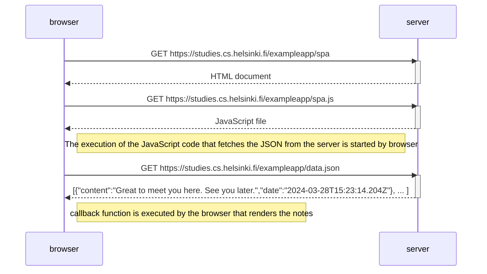

```mermaid
sequenceDiagram
    participant browser
    participant server

    browser->>server: GET https://studies.cs.helsinki.fi/exampleapp/spa
    activate server
    server-->>browser: HTML document
    deactivate server

    browser->>server: GET https://studies.cs.helsinki.fi/exampleapp/spa.js
    activate server
    server-->>browser: JavaScript file
    deactivate server

    Note right of browser: The execution of the JavaScript code that fetches the JSON from the server is started by browser

    browser->>server: GET https://studies.cs.helsinki.fi/exampleapp/data.json
    activate server
    server-->>browser: [{"content":"Great to meet you here. See you later.","date":"2024-03-28T15:23:14.204Z"}, ... ]
    deactivate server

    Note right of browser: callback function is executed by the browser that renders the notes
```